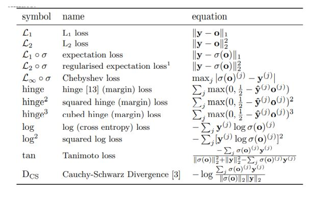

# Custom Loss Functions Implementation in Tensorflow
This notebook implements 12 different custom loss functions in tensor flow and uses them with a study on MNIST and CIFAR10 datasets using the following architectures:

  
   

## MNIST
The dataset consists of 60000 training sets and 10000 test sets of handwritten numbers
from 0 to 9 (10 classes), each of input shape of (28 x 28 x 1) pixels, and labels are one
hot encoded.
The architecture consists of a sequential model of 5 hidden dense layers each of 512
neurons, “Relu” activation function is applied after each layer with a dropout of 0.5
except for the last layer which is applied to the “Softmax” function.
Adam optimizer is used with a learning rate of 0.00003.

## CIFAR 10
The dataset consists of 50000 training sets and 10000 test sets of 10 different classes
represent airplanes, cars, birds, cats, deer, dogs, frogs, horses, ships, and trucks, each of
input shape of (32 x 32 x 3) pixels, and labels are one hot encoded.
The architecture consists of a sequential model of 5 hidden layers (3 Conv2D layers and
2 Dense layers), the first 3 conv2d layers have 64 kernels with kernel size of 5x5 and
activation function “Relu” is applied after each layer.
Max Pooling with size of 3x3 and strides of 2 is applied after the first layer and Average
Pooling with size of 3x3 and strides of 2 are applied after the second and the third layers.
The fourth layer consists of 128 neurons with a “Relu” activation function, and the last
layer consists of 10 neurons (classes) with a “Softmax” activation function.
Adam optimizer is used with a learning rate of 0.00003.

## References
This implementation was made corresponding to the following paper:
https://paperswithcode.com/paper/on-loss-functions-for-deep-neural-networks-in